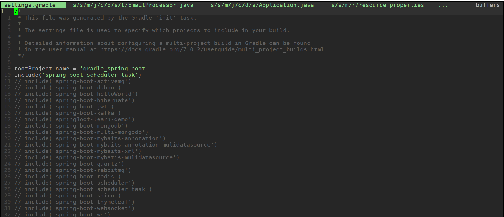
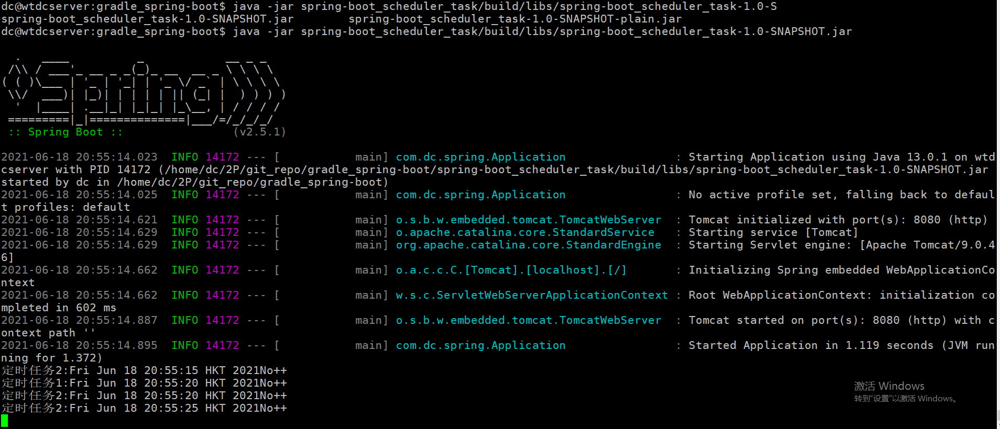

# Gradle spring-boot

Gradle spring-boot demo example

## Table of Contents

- [Background](#background)
- [Install](#install)
- [Usage](#usage)
	- [Generator](#generator)
- [Badge](#badge)
- [Example Readmes](#example-readmes)
- [Related Efforts](#related-efforts)
- [Maintainers](#maintainers)
- [Contributing](#contributing)
- [License](#license)

## Background

learn spring-boot example with gradle

## Install

1. Enviroment
```sh
$ uname -a
Linux wtdcserver 5.4.0-73-generic #82~18.04.1-Ubuntu SMP Fri Apr 16 15:10:02 UTC 2021 x86_64 x86_64 x86_64 GNU/Linux

$ java -version

java version "13.0.1" 2019-10-15
Java(TM) SE Runtime Environment (build 13.0.1+9)
Java HotSpot(TM) 64-Bit Server VM (build 13.0.1+9, mixed mode, sharing)

$ gradle -version
------------------------------------------------------------
Gradle 7.0.2
------------------------------------------------------------

Build time:   2021-05-14 12:02:31 UTC
Revision:     1ef1b260d39daacbf9357f9d8594a8a743e2152e

Kotlin:       1.4.31
Groovy:       3.0.7
Ant:          Apache Ant(TM) version 1.10.9 compiled on September 27 2020
JVM:          13.0.1 (Oracle Corporation 13.0.1+9)
OS:           Linux 5.4.0-73-generic amd64
```

2. Clone project

```sh
$ git clone https://github.com/DC-Melo/gradle_spring-boot.git
OR
$ git clone https://gitee.com/DC-Melo/gradle_spring-boot.git

$ cd gradle_spring-boot
```

3. enable the project you want to build

```
$ vim settings.gradle
for example:
// include('spring-boot_scheduler_task')
remove comment //
include('spring-boot_scheduler_task')
```


4. build project

```sh
$ ./gradlew build
```
5. check the builded jar in build folder

## Usage

run the jar file
```sh
$ java -jar spring-boot_scheduler_task/build/libs/spring-boot_scheduler_task-1.0-SNAPSHOT.jar 
```


### Generator


## Badge


## Example Readmes


## Related Efforts


## Maintainers

[@DC-Melo](https://github.com/DC-Melo)
[@DC-Melo](https://gitee.com/DC-Melo)

## Contributing

Feel free to dive in! [Open an issue](https://github.com/DC-Melo/standard-readme/issues/new) or submit PRs.

### Contributors

This project exists thanks to all the people who contribute. 
<a href="https://github.com/RichardLitt/standard-readme/graphs/contributors"></a>


## License

[MIT](LICENSE) © DC-Melo王江
